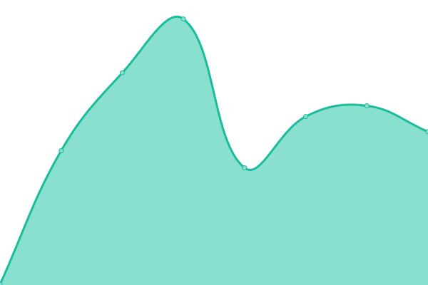
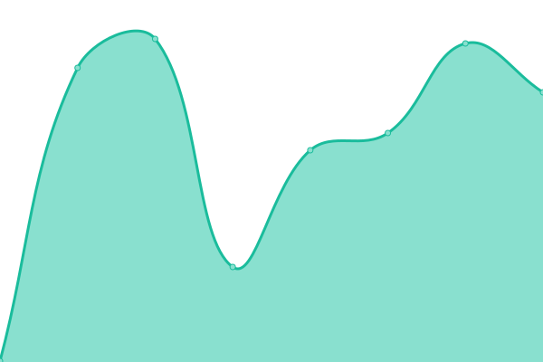
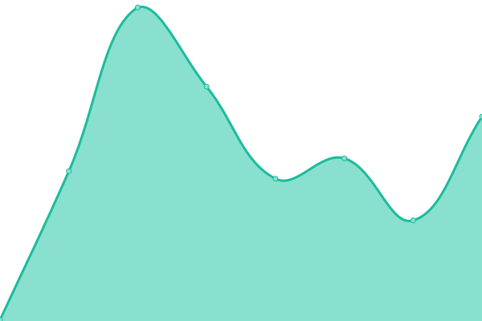

# [📈 Live Status](https://kin-labs.github.io/kinetic-upptime): <!--live status--> **🟧 Partial outage**

This repository contains the open-source uptime monitor and status page for [kin-labs](https://kin.org), powered by [Upptime](https://github.com/upptime/upptime).

With [Upptime](https://upptime.js.org), you can get your own unlimited and free uptime monitor and status page, powered entirely by a GitHub repository. We use [Issues](https://github.com/kin-labs/kinetic-upptime/issues) as incident reports, [Actions](https://github.com/kin-labs/kinetic-upptime/actions) as uptime monitors, and [Pages](https://kin-labs.github.io/kinetic-upptime) for the status page.

<!--start: status pages-->
<!-- This summary is generated by Upptime (https://github.com/upptime/upptime) -->
<!-- Do not edit this manually, your changes will be overwritten -->
<!-- prettier-ignore -->
| URL | Status | History | Response Time | Uptime |
| --- | ------ | ------- | ------------- | ------ |
|  [Kinetic Devnet](https://devnet.kinetic.kin.org) | 🟩 Up | [kinetic-devnet.yml](https://github.com/kin-labs/kinetic-upptime/commits/HEAD/history/kinetic-devnet.yml) | 

 268ms
     
 | 

<a href="https://kin-labs.github.io/kinetic-upptime/history/kinetic-devnet">100.00%</a>
    

|  [Kinetic Mainnet](https://mainnet.kinetic.kin.org) | 🟩 Up | [kinetic-mainnet.yml](https://github.com/kin-labs/kinetic-upptime/commits/HEAD/history/kinetic-mainnet.yml) | 

 220ms
     
 | 

<a href="https://kin-labs.github.io/kinetic-upptime/history/kinetic-mainnet">100.00%</a>
    

|  [Kinetic Docs](https://kinetic.kin.org) | 🟥 Down | [kinetic-docs.yml](https://github.com/kin-labs/kinetic-upptime/commits/HEAD/history/kinetic-docs.yml) | 

 281ms
     
 | 

<a href="https://kin-labs.github.io/kinetic-upptime/history/kinetic-docs">99.99%</a>
    

|  [Kinetic Demo](https://kinetic.pages.dev) | 🟥 Down | [kinetic-demo.yml](https://github.com/kin-labs/kinetic-upptime/commits/HEAD/history/kinetic-demo.yml) | 

 186ms
     
 | 

<a href="https://kin-labs.github.io/kinetic-upptime/history/kinetic-demo">99.99%</a>
    

<!--end: status pages-->

[**Visit our status website →**](https://kin-labs.github.io/kinetic-upptime)

## 📄 License

- Powered by: [Upptime](https://github.com/upptime/upptime)
- Code: [MIT](./LICENSE) © [kin-labs](https://kin.org)
- Data in the `./history` directory: [Open Database License](https://opendatacommons.org/licenses/odbl/1-0/)
